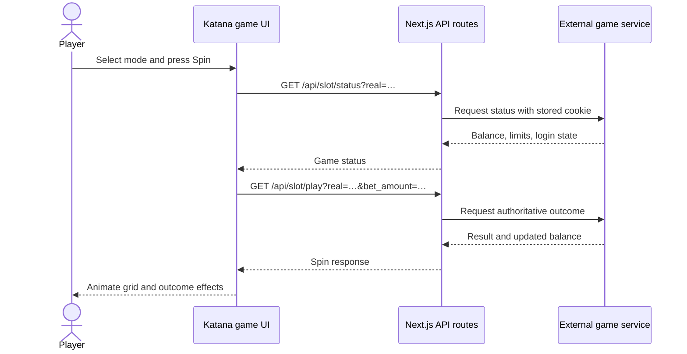

<div align="center">
  

  <h1>Katana Seduction</h1>

  <p><strong>A responsive, anime-inspired slot game experience built with Next.js.</strong></p>

  <a href="https://nextjs.org/"></a>
  <a href="https://react.dev/"></a>
  <a href="https://www.typescriptlang.org/"></a>
  <a href="https://tailwindcss.com/"></a>
</div>

<br />

Katana Seduction provides a themed entry screen, demo and real-game modes, a 5 × 7 symbol grid, animated spin outcomes, bet controls, sound controls, win effects, and an optional auto-spin flow.

The interface is a presentation and gameplay client. Balances and authoritative spin results are requested through local Next.js route handlers, which proxy an external casino game endpoint.

> **Important:** This project contains a real-money mode UI and an integration with an external casino service. It does not implement authentication, payments, player verification, gambling compliance, or a secure session store. Do not use it in production with real-money wagering without completing the required security, legal, licensing, and responsible-gaming work.

## At a glance

| 🎮 Gameplay | ✨ Presentation | 🔌 Integration |
| --- | --- | --- |
| Demo and real-game paths, single spin, auto-spin, wager selection, and balance reset. | Custom character symbols, staggered reel drops, sound, confetti, win highlights, and responsive controls. | Local API routes proxy the authoritative external game service for status, spins, and resets. |

### Features

| Area | Included experience |
| --- | --- |
| **Lobby** | Dedicated **Play Free Demo** and **Play With Money** entry points. The selected mode is carried by the `real` query parameter. |
| **Slot board** | A responsive 5 × 7 board using 20 custom character and treasure symbols, with idle highlights and animated clear-and-drop transitions. |
| **Controls** | Adjustable wagers that use the server-provided limits, a primary spin control, auto-spin, reset, game-mode switching, and sound settings. |
| **Outcomes** | Server-driven balances and results; locally generated visual win/loss grids that respond to `winningPower`. |
| **Celebrations** | Progress meter, audio, confetti, win-cell glow, and—on high-power wins—screen shake and a chromatic flash. |
| **Resilience** | Branded loading state, retry action, and visible network-error feedback. |

## Technology

| Area | Used in this project |
| --- | --- |
| Framework | Next.js 16 with the App Router |
| UI | React 19 and TypeScript |
| Styling | Tailwind CSS 4 |
| Animation / effects | CSS animations, Web Audio API, `canvas-confetti` |
| Icons | `react-icons` |
| Backend boundary | Next.js route handlers that proxy the external game API |

## Requirements

- Node.js 20.9 or newer (a current Node.js LTS release is recommended)
- npm (the repository includes `package-lock.json`)
- Internet access when using the game screen, because status, play, reset, and side-content requests rely on the external casino service

## Quick start

```bash
npm install
npm run dev
```

Open [http://localhost:3000](http://localhost:3000). Choose a mode from the start screen, or open one directly:

```text
http://localhost:3000/katana?real=0  # demo mode
http://localhost:3000/katana?real=1  # real mode
```

<details>
<summary><strong>Available commands</strong></summary>

<br />

```bash
npm run lint    # run ESLint
npm run build   # create a production build
npm run start   # run the production server after a build
```

</details>

## How the game works

1. The home page sends the player to `/katana`, adding `real=0` for demo mode or `real=1` for real mode.
2. The game view requests `/api/slot/status` for the current mode. A branded loader remains visible for at least three seconds and for two seconds after the request completes.
3. The slot machine uses the returned balance, minimum bet, maximum allowed bet, spin eligibility, and login state to configure the UI.
4. When a player spins, the browser calls `/api/slot/play` with the selected `bet_amount`.
5. The received outcome determines the balance and whether the board displays a generated winning or losing grid. Winning symbols are selected from a bucket associated with `winningPower`.
6. The existing symbols exit, the grid briefly clears, and the new symbols drop in. A win then highlights matching cells and triggers effects scaled to the win power.
7. If auto-spin is enabled and the server still permits play, another spin begins after a three-second pause.

In real mode, the client prevents spins and auto-spin when the upstream service reports that the visitor is not logged in. The external service remains responsible for authenticating that visitor and deciding all balances and outcomes.



## Project structure

```text
app/
├── (Game)/
│   ├── page.tsx                 # mode-selection landing screen
│   └── katana/page.tsx          # game route and suspense boundary
├── api/slot/
│   ├── status/route.ts          # proxies current game status
│   ├── play/route.ts            # proxies a spin request
│   └── reset/route.ts           # proxies balance reset
├── layout.tsx                   # global font, background overlay, side content
└── globals.css                  # theme and gameplay animations

components/
├── Games/
│   ├── KatanaGame.tsx           # route-level state, loader, mode and reset actions
│   └── SlotMachine.tsx          # grid, spin sequence, effects, audio and controls
└── ui/                          # reusable buttons, loader, slider and helpers

lib/
└── sessionStore.ts              # current upstream cookie storage

public/
├── images/                      # backgrounds, buttons, avatars and slot symbols
└── sounds/                      # background and spin audio
```

## API routes and upstream service

The browser only calls routes on this Next.js application. Those routes forward requests to `https://cryptocasino.vegas/win/games-save-play.php` and pass along the currently stored cookie.

| Local route | Query parameters | Purpose |
| --- | --- | --- |
| `GET /api/slot/status` | `real` | Loads balance, bet limits, mode, login status, and spin availability. |
| `GET /api/slot/play` | `real`, `bet_amount` | Requests an authoritative spin result and updated balance. |
| `GET /api/slot/reset` | `real` | Requests a balance reset for the selected mode. |

The layout also loads an external side-content script from the same upstream host. That script is not bundled or controlled by this repository.

### Expected spin response

The client reads the following properties from the play endpoint:

```ts
type SpinResponse = {
  bananaWon: number;
  newBalance: number;
  isWin: boolean;
  maxAllowedBet: number;
  minBet: number;
  canSpin: boolean;
  spinMessageExtra: string;
  mode: string;
  isLoggedIn: boolean;
  winningPower: number | null;
  symbol: string | null;
  pattern?: Pattern | null;
};
```

`winningPower` is clamped to `0–100`. It selects a symbol bucket and controls the strength of the visual celebration; wins at 85 or above also use a screen shake and chromatic flash. The client creates the visual grid locally—it does not use a server-provided reel layout.

## Assets and UI behavior

- `public/images/characters` holds the 20 SVGs used in the slot grid.
- `public/images/avatars` and the background images build the lobby and game scene.
- `public/images/buttons` contains the themed control artwork.
- `public/sounds/game_sound.mp3` loops as the background track; `play_sound.mp3` accompanies grid movement.
- A generated Web Audio API tone is layered over the background track for wins and losses.
- The settings panel currently exposes sound only; its additional settings copy is a placeholder for future controls.

Modern browsers may block autoplay until the visitor interacts with the page. The app catches that browser restriction, so gameplay remains usable if music does not start automatically.

## Deployment and security notes

The current `lib/sessionStore.ts` implementation is a single module-level string. It is suitable only for simple local experimentation. In a long-running shared process it can mix cookies between users; in serverless or multi-instance deployments it will not persist or be consistent between requests.

Before deploying, replace it with a per-user, secure session design—for example, encrypted HTTP-only cookies or a server-side session store keyed to an authenticated user. Also consider the following:

- Keep the upstream URL in environment configuration rather than source code.
- Validate upstream responses and return consistent errors from all route handlers.
- Add request timeouts, rate limiting, structured logging, and monitoring.
- Review the external script and remote asset policy, including a suitable Content Security Policy.
- Obtain the appropriate licenses, age checks, regional controls, and responsible-gaming safeguards for any gambling use case.

## Development notes

- There are no required environment variables in the current codebase.
- The `symbol` and `pattern` fields are declared in the client response type, but the visual symbol and pattern are currently derived from `winningPower`.
- The game surfaces are client components where interactive gameplay state is required; server route handlers form the upstream proxy boundary.
- The app uses the `@/*` TypeScript alias for imports from the repository root.

## License

No license file is currently included.
